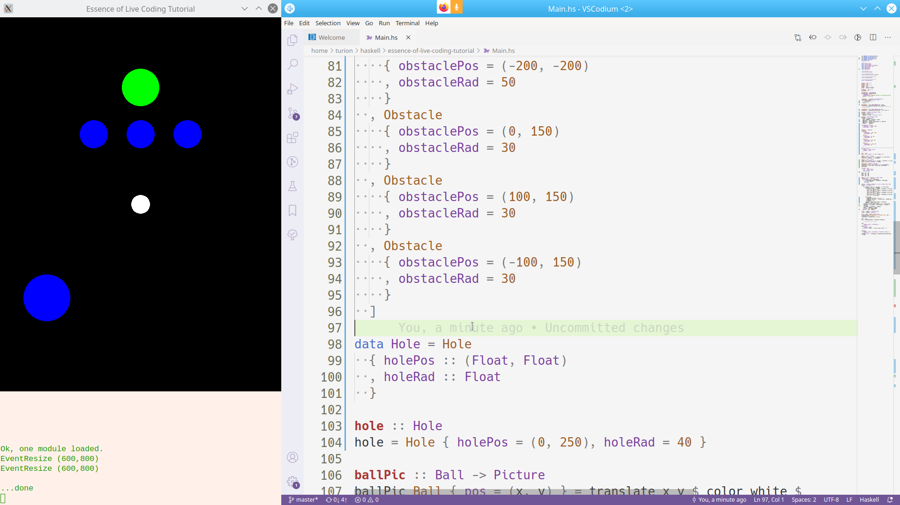
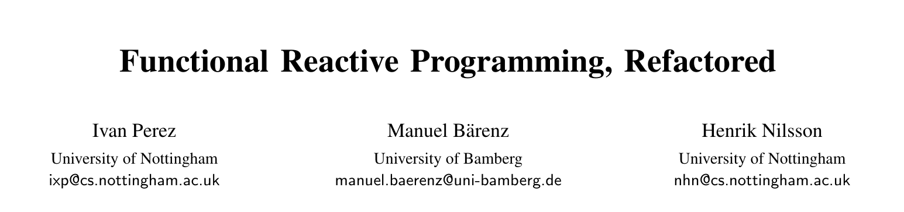
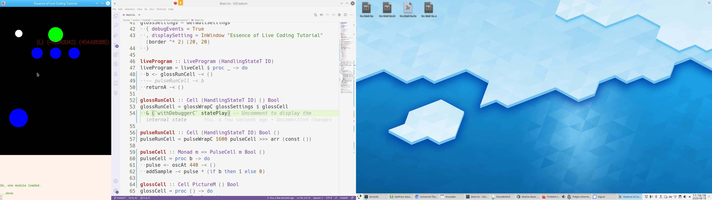

# Introduction

## The essence of live coding

* Live coding framework prototype
* Capture the essential idea
* Audio, video, web, ...
* Modular FRP DSL
* Type-driven, automatic, extensible state migration

## Change the program, keep the state!

::: notes

Explain what we're going to code briefly

:::
{style="height: 400px;"}

# How does it work?

## A live program

* Internal state
* State transition function
* Side effects

##

``` {.haskell .literate .fragment .fade-in}
data LiveProgram m = forall s .
  LiveProgram
  { liveState :: s
  , liveStep  :: s -> m s
  }
```

``` {.haskell .literate .fragment .fade-in}
runLiveProgram :: LiveProgram m -> m ()
runLiveProgram LiveProgram { .. } = do
  liveState' <- liveStep liveState
  runLiveProgram LiveProgram { liveState = liveState', .. }
```

[Polymorphic in `m`:]{.fragment .fade-in}

* Determinism (no hidden `IO`)
* Arbitrary effects: Bind to any backend

## Example

``` {.haskell .literate .fragment .fade-in}
data State = State
  { nVisitors :: Integer
  }

server greeting = LiveProgram { .. } where
  liveState = State 1
  liveStep State { .. } = do
    putStrLn $ greeting ++ show nVisitors
    return State { nVisitors = nVisitors + 1, .. }

yeOldeServer = server "Greetings, number "
```

## Change the program...

``` {.haskell .literate .fragment .fade-in}
nuSrvr = server "HI #"
```

``` {.fragment .fade-in}
Greetings, number 1
Greetings, number 2
HI #3
```

## Thank you for your attention.

* That was a joke.

## ...change the program...


``` {.haskell .literate .fragment .fade-in}
data State = State
  { nVisitors :: Integer
  , lastTime  :: UTCTime
  }
```

``` {.haskell .literate .fragment .fade-in}
server greeting = LiveProgram { .. } where
  liveState = State 1 $ read "2019-07-24 19:00:00 UTC"
  liveStep State { .. } = do
    putStrLn $ greeting ++ show nVisitors
    lastTime <- getCurrentTime
    return State { nVisitors = nVisitors + 1, .. }
```

[...but the new state won't type-check!]{.fragment .fade-in .alert-red}

## ...keep the state??

* Well-known problem in databases
* Need _state migrations_
* Should be automatic

## Example

Migrating to new state should...

* ...preserve `nVisitors`
* ...insert initial/default value for `lastTime`

[⇒ Need _old live state_ and _new initial state_]{.fragment .fade-in}

``` {.haskell .literate .fragment .fade-in}
migrate :: sNew -> sOld -> sNew
```

::: notes

* Ask the audience.
  Such a migrate function exists: `const`

:::


## Actual implementation: Generics

``` {.haskell .literate .fragment .fade-in}
migrate :: (Data sNew, Data sOld) => sNew -> sOld -> sNew
migrate = ... -- Just some 50 lines generic code
```

[Conversion from/to...]{.haskell .literate .fragment .fade-in}

* ...same record fields
* ...same constructor names
* ...newtypes

## Type-driven migration

Small restriction: Add `Data` to all states:

``` {.haskell .literate .fragment .fade-in}
data LiveProgram m = forall s .
  Data s =>
  LiveProgram
  { liveState :: s
  , liveStep  :: s -> m s
  }
```

[The migration is derived from the state type!]{.haskell .literate .fragment .fade-in}

# Functional Reactive Programming

## What's missing? [_Modularity_]{.fragment .fade-in}

* Want to combine new live programs from existing building blocks.
* _"Functional"_

[⇒ Add inputs and outputs to live programs!]{.fragment .fade-in}

## Cells

``` {.haskell .literate .fragment .fade-in}
data Cell m a b = forall s . Data s => Cell
  { cellState :: s
  , cellStep  :: s -> a -> m (b, s)
  }
```

## `Category`
{.fragment .fade-in style="border: none"}
{.fragment .fade-in style="border: none"}

``` {.haskell .literate .fragment .fade-in}
id :: Cell m a a
```


``` {.haskell .literate .fragment .fade-in}
(>>>)
  :: Monad m
  => Cell  m a b
  -> Cell  m   b c
  -> Cell  m a   c
```

## `Arrow`

{.fragment .fade-in style="border: none"}
{.fragment .fade-in style="border: none"}

``` {.haskell .literate .fragment .fade-in}
arr
  ::       (a -> b)
  -> Cell m a    b
```

``` {.haskell .literate .fragment .fade-in}
(***)
  :: Monad m
  => Cell  m  a      b
  -> Cell  m     c      d
  -> Cell  m (a, c) (b, d)
```

## Composing cells to live programs

``` {.haskell .literate .fragment .fade-in}
sensor    :: Cell IO () a
signalFun :: Cell m     a b
actuator  :: Cell IO      b ()
```

``` {.haskell .literate .fragment .fade-in}
liveCell :: Cell m () () -> LiveProgram m
```

``` {.haskell .literate .fragment .fade-in}
mainProgram :: LiveProgram IO
mainProgram = liveCell
  $ sensor >>> signalFun >>> actuator
```

## Wait... I've seen this before!?

::: notes

There we also explain why this is FRP.

:::

``` {.haskell .literate .fragment .fade-in}
data MSF m a b => MSF { unMSF :: a -> m (b, MSF m a b) }
```

::: {.fragment .fade-in}

Haskell Symposium 2016
:::

## Example

``` {.haskell .literate .fragment .fade-in}
sumC = Cell { .. } where
  cellState = 0
  cellStep accum a = return (accum, accum + a)
```

``` {.haskell .literate .fragment .fade-in}
stepRate = 30
integrate = arr (/ stepRate) >>> sumC
```

## Arrow notation

``` {.haskell .literate .fragment .fade-in}
freeFall
  =   arr (const (0, -9.81))
  >>> (   (integrate >>> integrate)
      *** (integrate >>> integrate))
```

``` {.haskell .literate .fragment .fade-in}
freeFall = proc () -> do
  let (accX, accY) = (0, -9.81)
  velX <- integrate -< accX
  posX <- integrate -< velX
  velY <- integrate -< accY
  posY <- integrate -< velY
  returnA           -< (posX, posY)
```

## More Arrow perks

* `ArrowChoice`: (Transient) control flow
* `ArrowLoop`: Recursion (but beware!)

``` {.haskell .literate .fragment .fade-in}
  let (accX, accY) = (0, -9.81)
  velX <- integrate -< accX
  posX <- integrate -< velX
  rec
    velY <- if posY >= 0
      then do
        integrate -< accY
      else
        returnA   -< 0
    posY <- integrate -< velY
  returnA           -< (posX, posY)
```

## Gloss backend

* `PictureM`: Retrieve events, IO, add pictures

``` {.haskell .literate .fragment .fade-in}
glossCell :: Cell PictureM () ()
glossCell = proc () -> do
  events <- constM ask  -< ()
  arrM $ liftIO . print -< events
  ball <- ballSim       -< events
  addPicture            -< ballPic ball
```

* `HandlingStateT`: Handle Gloss thread

``` {.haskell .literate .fragment .fade-in}
glossRunCell :: Cell (HandlingStateT IO) () ()
glossRunCell = glossWrapC glossSettings glossCell
```

## Monadic control flow

::: notes

* Exception just another monad
* Exception in the state => state migration preserves control flow state (e.g. to where we currently switched) out of the box

:::

[Throwing and catching exceptions]{.fragment .fade-in}

``` {.haskell .literate .fragment .fade-in}
wait :: Monad m => Double -> Cell (ExceptT () m) a a
wait tMax = proc a -> do
  t <- integrate -< 1
  if t >= tMax
    then throwC  -< ()
    else returnA -< a
```

``` {.haskell .literate .fragment .fade-in}
afterTwoSeconds :: Cell m a String
afterTwoSeconds = safely $ do
  try  $   arr (const "Waiting...")
       >>> wait 2
  safe $   arr (const "Done waiting.")
```

# Extra perks

## GHCi runtime

Custom GHCi commands:

* Launch live program in separate thread
* Edit file, reload, while keeping program running
* (uses package `foreign-store` under the hood)
* Gloss and Pulseaudio adapter

## QuickCheck

* Test output of cells for arbitrary series of inputs
* Launch test cell before migrating "production" cell
* `Data` ⇒ automatically generate cell state for tests

## Debugging

"A debugger is a live program that can read and modify
the state of another live program."

``` {.haskell .literate .fragment .fade-in}
newtype Debugger m = Debugger
  { getDebugger :: forall s .
      Data s => LiveProgram (StateT s m)
  }
```

``` {.haskell .literate .fragment .fade-in}
withDebugger
  :: Monad       m
  => LiveProgram m
  -> Debugger    m
  -> LiveProgram m
```

## Example: Gloss debugger



# Outlook

## What I haven't shown

* Works for web servers as well
* Extensible by custom user migrations
* Integrate into external main loops
* Control flow: The details

## Further directions

* Backends (Audio, web, OpenGL, ...)
* Integrate with asynchronous FRP framework (Rhine. ICFP 2019. Iván Pérez & MB)
* Ensuring state properties beyond Haskell types (LiquidHaskell)

## Thanks! Questions?

::: {style="font-size: 68%"}
------------- -----
Manuel Bärenz Essence Of Live Coding
Github        [https://github.com/turion/essence-of-live-coding](https://github.com/turion/essence-of-live-coding)
Hackage       [https://hackage.haskell.org/package/essence-of-live-coding](https://hackage.haskell.org/package/essence-of-live-coding)
Article       [https://www.manuelbaerenz.de/essence-of-live-coding/EssenceOfLiveCoding.pdf](https://www.manuelbaerenz.de/essence-of-live-coding/EssenceOfLiveCoding.pdf)
Presentation  [https://www.manuelbaerenz.de/essence-of-live-coding/EssenceOfLiveCodingPresentation.html](https://www.manuelbaerenz.de/essence-of-live-coding/EssenceOfLiveCodingPresentation.html)
Abstract      [https://www.manuelbaerenz.de/essence-of-live-coding/EssenceOfLiveCodingAbstract.pdf](https://www.manuelbaerenz.de/essence-of-live-coding/EssenceOfLiveCodingAbstract.pdf)
Appendix      [https://www.manuelbaerenz.de/essence-of-live-coding/EssenceOfLiveCodingAppendix.pdf](https://www.manuelbaerenz.de/essence-of-live-coding/EssenceOfLiveCodingAppendix.pdf)
------------- -----
:::

# Backup

## Migrations

``` {.haskell .literate}
data Migration = Migration
  { runMigration :: forall a b . (Data a, Data b)
      => a -> b -> Maybe a
  }

instance Monoid Migration where ...

migrateWith
  :: (Data a, Data b)
  => Migration
  -> a -> b -> a
```

## QuickCheck

``` {.haskell .literate}
instance (Arbitrary a, Show a, Testable prop)
  => Testable (Cell IO a prop) where ...

testCell :: Monad m => Cell m (Positive Int) Bool
testCell = arr getPositive >>> sumC >>> arr (>= 0)
```

```
 > quickCheck testCell
+++ OK, passed 100 tests.
```

``` {.haskell .literate}
logTest :: Monad m => Cell m a prop -> Cell (WriterT [prop] m) a ()
logTest cell = liftCell cell >>> arrM (return >>> tell)

liveCheck :: Testable prop => Bool
  -> LiveProgram (WriterT [prop] IO)
  -> LiveProgram                 IO
```

## FRP internal state

``` {.haskell .literate}
data Composition state1 state2 = Composition
  { state1 :: state1
  , state2 :: state2
  } deriving Data

instance Monad m => Category (Cell m) where
  id = ...

  Cell state1 step1 >>> Cell state2 step2 = Cell { .. }
    where
      cellState = Composition state1 state2
      cellStep ... = ...
```

## Exceptions

``` {.haskell .literate}
runExceptT :: ExceptT e m b -> m (Either e b)

runExceptC
  :: (Data e, Monad m)
  => Cell (ExceptT e m) a           b
  -> Cell            m  a (Either e b)

data ExceptState state e
  = NotThrown state
  | Exception e
  deriving Data
```

## Finite exceptions

``` {.haskell .literate}
(>>>=) :: (Data e1, Monad m)
  => Cell (ExceptT e1    m)      a  b
  -> Cell (ExceptT    e2 m) (e1, a) b
  -> Cell (ExceptT    e2 m)      a  b

class Finite e where
  commute
    :: Monad      m
    => (e -> Cell m     a  b)
    -> Cell       m (e, a) b
```

## Coalgebras

``` {.haskell .literate}
type StateTransition m a b s = a -> m (b, s)

data MSF m a b = MSF (StateTransition m a b (MSF m a b))

data Coalg m a b = forall s .
     Coalg s (s -> StateTransition m a b s)

cellCoalgebra :: Cell m a b -> Coalg m a b
coalgebra     :: MSF  m a b -> Coalg m a b

finality      :: Monad m => Coalg m a b -> MSF m a b
finalityC     :: Monad m => Cell  m a b -> MSF m a b

coalgebraC    :: Data (MSF m a b) => MSF m a b -> Cell m a b
```
